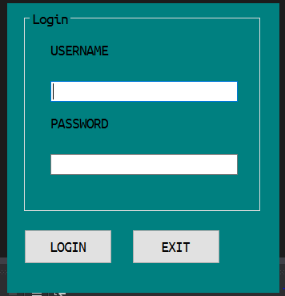

<body>

<h1>Login using Data Abstraction Technique in C#</h1>

<h3>A program that illustrate how login can be done using the   data abstraction technique, the OOP way. </h3>

<a href="http://twitter.com/the_asangam" target="_blank" ><footer>Sangam Adhikari</footer> </a>

</body>